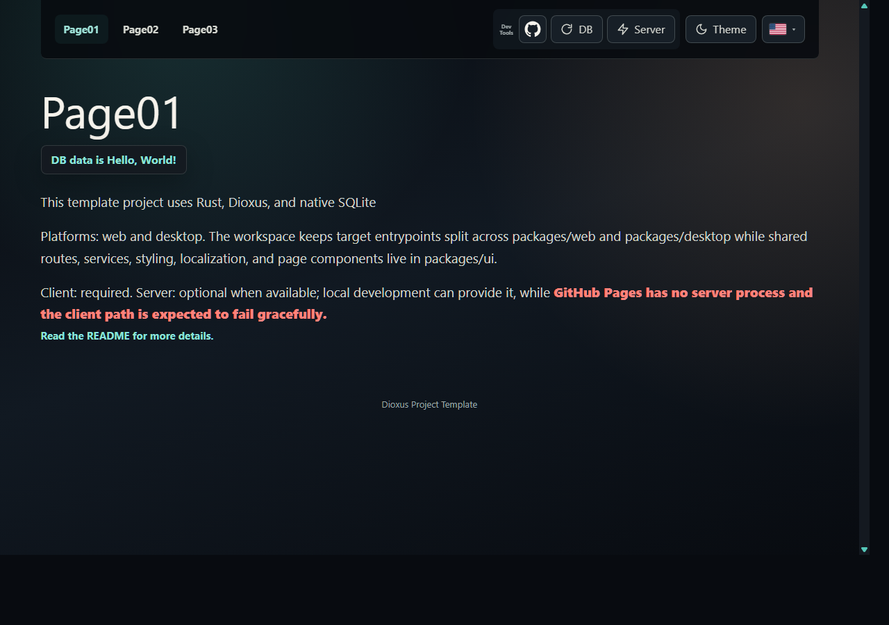
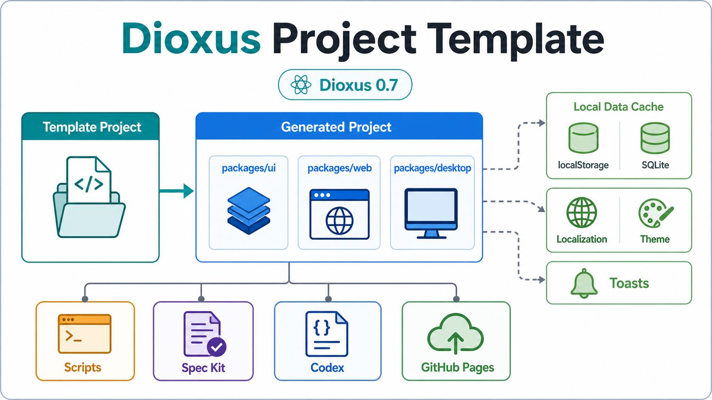

# Dioxus Project Template

This is a project template for Dioxus full-stack Rust projects.

Clone the repo and use the [`create-project-from-template` skill](./.codex/skills/create-project-from-template/SKILL.md) to use it.

## TOC

- [Dioxus Project Template](#dioxus-project-template)
  - [TOC](#toc)
  - [Live Demo](#live-demo)
  - [Pics](#pics)
  - [Gettings started](#gettings-started)
- [Details](#details)
  - [Structure](#structure)
  - [Features](#features)
    - [Release Deployment](#release-deployment)
- [Credits](#credits)

<BR>

## Live Demo

https://samuelasherrivello.github.io/dioxus-project-template/latest/

The static web build is exported and hosted when a GitHub Release is published. Versioned releases live under `/releases/<version>/`, and `/latest/` points at the newest release.

<!-- AI: Section purpose: show the hosted template web build. When `.codex/skills/create-project-from-template` is used, update `.specs/generated/README.md` only if generated projects should also advertise a live deployment link; otherwise leave this template-only Pages URL out of generated READMEs. -->

<BR>

## Pics

<div style="display: flex; align-items: flex-start; gap: 16px;">
  <a href="./Documentation/Images/Screenshot01.png" style="display: inline-block;"></a>
  <a href="./Documentation/Images/Infographic01.png" style="display: inline-block;"></a>
</div>

<!-- AI: Section purpose: show visual proof of the template app and a high-level infographic. When `.codex/skills/create-project-from-template` is used, generated repos inherit the image files but use `.specs/generated/README.md` for their root README; add a matching Pics section there only if new projects should start with visible screenshots. -->

<BR>

## Gettings started

### Common Scripts

| Command | Required? | Description |
| ------- | --------- | --- |
| `.\Scripts\Common\InstallDependencies.ps1` | ✅ | Installs repository dependencies and builds Tailwind CSS output. |
| `.\Scripts\Common\RunWeb.ps1` | ✅ | Starts the web app on a concrete local IPv4 address. Stops an older `dx serve` process on that port first. |

### Other Scripts

| Command | Required? | Description |
| ------- | --------- | --- |
| `.\Scripts\Other\RunDesktop.ps1` | ❌ | Starts the desktop app with Dioxus desktop. |
| `.\Scripts\Other\RunTests.ps1` | ❌ | Runs UI crate tests. |

<!-- AI: Section purpose: list the supported setup, run, and test commands. When `.codex/skills/create-project-from-template` is used, keep this table aligned with `.specs/generated/README.md` because generated repos need the same script names unless the helper or script layout changes. -->

<BR>

# Details

## Structure

### Root Folders

| # | Name | In Git? | Purpose |
| - | ---- | ------- | ------- |
| 01 | [`.agents`](./.agents) | ✅ | Codex-facing Spec Kit skills used for specify, plan, tasks, implementation, and analysis workflows. |
| 02 | [`.codex`](./.codex) | ✅ | Repo-local Codex guidance, project identity notes, rules, and template-specific skills. |
| 03 | [`.github`](./.github) | ✅ | GitHub Actions and repository automation, including the web export workflow. |
| 04 | [`.specify`](./.specify) | ✅ | Spec Kit configuration, templates, scripts, workflows, constitution, and active feature state. |
| 05 | [`.specs`](./.specs) | ✅ | Template Project specs and Generated Project starter specs. |
| 06 | [`Documentation`](./Documentation) | ✅ | Screenshots, infographic images, and other supporting docs. |
| 07 | [`packages`](./packages) | ✅ | Rust workspace crates for the shared UI, web entrypoint, and desktop entrypoint. |
| 08 | [`Scripts`](./Scripts) | ✅ | PowerShell setup, run, test, and maintenance scripts. |
| 09 | [`data`](./data) | ❌ | Local native runtime database output for desktop/non-wasm runs; generated and not template source. |
| 10 | [`node_modules`](./node_modules) | ❌ | Local Node dependency cache for Tailwind tooling; generated and not template source. |
| 11 | [`target`](./target) | ❌ | Cargo build output; generated and not template source. |
| 12 | [`tmp`](./tmp) | ❌ | Local scratch output; generated and not template source. |

<!-- AI: Section purpose: explain only root-level folders, not nested paths or file inventories. When `.codex/skills/create-project-from-template` is used, generated repos remove `.specs` and receive generated root docs from `.specs/generated/`; mirror this section there only with folders that should exist in the generated project. -->

### Source Folders

| Path | Description |
| ---- | ----------- |
| [`packages/ui`](./packages/ui) | Shared Dioxus UI crate split into routed pages, components, models, client services, assets, and tests. |
| [`packages/web`](./packages/web) | Web entrypoint, favicon, generated Tailwind CSS, and minimal web CSS for theme variables and document-level behavior. |
| [`packages/desktop`](./packages/desktop) | Desktop entrypoint, generated Tailwind CSS, and minimal desktop CSS for theme variables and document-level behavior. |

The shared UI crate owns the app shell, routes, toast region, developer tools, localization, theme persistence, and the generic template data example. Component styling is intentionally Tailwind-heavy so generated projects start with utility-first layout, spacing, responsive states, colors, and typography.

The current cache path is static-host friendly: browser builds use a localStorage snapshot, while non-wasm builds use native SQLite under local `data/`. First-time SQLite schema creation and seed data live in `create_database_if_missing()` in the database service.

<!-- AI: Section purpose: summarize the app/workspace architecture and cache boundaries. When `.codex/skills/create-project-from-template` is used, keep generated-project architecture notes in `.specs/generated/README.md` aligned with reusable workspace facts, but omit template-only `.specs/template` and `.specs/generated` rows after generation. -->

<BR>

## Features

### Codex AI Features

This repo includes optional but recommended [Codex](./.codex/README.md) context and [Spec Kit](./.specify/README.md) workflows so agent prompts can stay short and consistent.

Related tech: [OpenAI Codex](https://openai.com/codex)

| File | Purpose |
| ---- | ------- |
| [`AGENTS.md`](./AGENTS.md) | Dioxus rules and project workflow instructions for agents. |
| [`.aiignore`](./.aiignore) | Common AI-agent ignore file for build output, runtime data, test artifacts, logs, and dependency caches. |
| [`.agents/skills/`](./.agents/skills) | Spec Kit skills for Codex, invoked as `$speckit-constitution`, `$speckit-specify`, `$speckit-plan`, `$speckit-tasks`, and related commands. |
| [`.specs/template/`](./.specs/template) | Template Project maintenance guidance and specs. |
| [`.specs/generated/`](./.specs/generated) | Generated Project replacement docs and starter specs. |
| [`.codex/project-identity.md`](./.codex/project-identity.md) | Rename checklist for turning this template into a new named project. |
| [`.codex/rules/`](./.codex/rules/frontend-design.md) | Frontend design and Dioxus workflow guidance for this template. |
| [`.codex/skills/`](./.codex/skills/dioxus-project-template/SKILL.md) | Project-specific skill guidance for Dioxus, cache, and verification work. |
| [`.specify/`](./.specify) | Spec Kit project configuration, constitution, PowerShell workflow scripts, and templates. |

<!-- AI: Section purpose: describe repo-local Codex, agent, and Spec Kit guidance surfaces. When `.codex/skills/create-project-from-template` is used, the helper renames project identity and removes `.specs`; keep generated-project Codex guidance in `.specs/generated/README.md` focused on the generated repo, not template maintenance. -->

### Dioxus Components

This grid covers the Dioxus Components gallery. ✅ means this template imports or implements that Dioxus Components component, not just a similarly named HTML element or local utility.

Related tech: [Dioxus Components](https://dioxuslabs.com/components/)

| # | Component Docs | Usage |
| - | -------------- | ----- |
| 1 | [Accordion](https://dioxuslabs.com/components/?name=accordion) | ❌ Not used. |
| 2 | [Alert Dialog](https://dioxuslabs.com/components/?name=alert_dialog) | ✅ [`ConfirmationPrompt`](./packages/ui/src/client/components/prompt.rs) uses `dioxus_primitives::alert_dialog` for the Page03 confirmation flow. |
| 3 | [Aspect Ratio](https://dioxuslabs.com/components/?name=aspect_ratio) | ✅ [`Page03`](./packages/ui/src/client/pages/page03.rs) uses `dioxus_primitives::aspect_ratio::AspectRatio` for the mobile-first prompt frame. |
| 4 | [Avatar](https://dioxuslabs.com/components/?name=avatar) | ❌ Not used. |
| 5 | [Badge](https://dioxuslabs.com/components/?name=badge) | ❌ Not used. |
| 6 | [Button](https://dioxuslabs.com/components/?name=button) | ❌ The app uses native `button` elements with local Tailwind classes, not the Dioxus Components `Button`. |
| 7 | [Calendar](https://dioxuslabs.com/components/?name=calendar) | ❌ Not used. |
| 8 | [Card](https://dioxuslabs.com/components/?name=card) | ❌ Not used. |
| 9 | [Checkbox](https://dioxuslabs.com/components/?name=checkbox) | ❌ Not used. |
| 10 | [Collapsible](https://dioxuslabs.com/components/?name=collapsible) | ❌ Not used. |
| 11 | [Color Picker](https://dioxuslabs.com/components/?name=color_picker) | ❌ Not used. |
| 12 | [Context Menu](https://dioxuslabs.com/components/?name=context_menu) | ❌ Not used. |
| 13 | [Date Picker](https://dioxuslabs.com/components/?name=date_picker) | ❌ Not used. |
| 14 | [Dialog](https://dioxuslabs.com/components/?name=dialog) | ❌ The app uses Alert Dialog for confirmation; the general Dialog component is not used. |
| 15 | [Drag And Drop List](https://dioxuslabs.com/components/?name=drag_and_drop_list) | ❌ Not used. |
| 16 | [Dropdown Menu](https://dioxuslabs.com/components/?name=dropdown_menu) | ❌ The language selector is a local button/options menu, not the Dioxus Components Dropdown Menu. |
| 17 | [Form](https://dioxuslabs.com/components/?name=form) | ❌ Not used. |
| 18 | [Hover Card](https://dioxuslabs.com/components/?name=hover_card) | ❌ Not used. |
| 19 | [Input](https://dioxuslabs.com/components/?name=input) | ❌ The app uses native `input` only where needed; the Dioxus Components `Input` is not installed. |
| 20 | [Item](https://dioxuslabs.com/components/?name=item) | ❌ Not used. |
| 21 | [Label](https://dioxuslabs.com/components/?name=label) | ❌ Not used. |
| 22 | [Menubar](https://dioxuslabs.com/components/?name=menubar) | ❌ Not used. |
| 23 | [Navbar](https://dioxuslabs.com/components/?name=navbar) | ❌ The template has a local [`PageHeader`](./packages/ui/src/client/components/page_header.rs), not the Dioxus Components Navbar. |
| 24 | [Pagination](https://dioxuslabs.com/components/?name=pagination) | ❌ Not used. |
| 25 | [Popover](https://dioxuslabs.com/components/?name=popover) | ❌ Not used. |
| 26 | [Progress](https://dioxuslabs.com/components/?name=progress) | ❌ Not used. |
| 27 | [Radio Group](https://dioxuslabs.com/components/?name=radio_group) | ❌ Not used. |
| 28 | [Scroll Area](https://dioxuslabs.com/components/?name=scroll_area) | ❌ Not used. |
| 29 | [Select](https://dioxuslabs.com/components/?name=select) | ❌ The app uses local button-based language choices, not the Dioxus Components Select. |
| 30 | [Separator](https://dioxuslabs.com/components/?name=separator) | ❌ Not used. |
| 31 | [Sheet](https://dioxuslabs.com/components/?name=sheet) | ❌ Not used. |
| 32 | [Sidebar](https://dioxuslabs.com/components/?name=sidebar) | ❌ Not used. |
| 33 | [Skeleton](https://dioxuslabs.com/components/?name=skeleton) | ❌ Not used. |
| 34 | [Slider](https://dioxuslabs.com/components/?name=slider) | ❌ Not used. |
| 35 | [Switch](https://dioxuslabs.com/components/?name=switch) | ❌ Not used. |
| 36 | [Tabs](https://dioxuslabs.com/components/?name=tabs) | ❌ Not used. |
| 37 | [Textarea](https://dioxuslabs.com/components/?name=textarea) | ❌ Not used. |
| 38 | [Toast](https://dioxuslabs.com/components/?name=toast) | ❌ The app has a local [`ToastRegion`](./packages/ui/src/client/components/toast.rs); it does not use the Dioxus Components Toast. |
| 39 | [Toggle](https://dioxuslabs.com/components/?name=toggle) | ❌ Not used. |
| 40 | [Toggle Group](https://dioxuslabs.com/components/?name=toggle_group) | ❌ Not used. |
| 41 | [Toolbar](https://dioxuslabs.com/components/?name=toolbar) | ❌ Not used. |
| 42 | [Tooltip](https://dioxuslabs.com/components/?name=tooltip) | ❌ The app uses local `data-tooltip` styling in [`page_header.css`](./packages/ui/assets/styling/page_header.css), not the Dioxus Components Tooltip. |
| 43 | [Virtual List](https://dioxuslabs.com/components/?name=virtual_list) | ❌ Not used. |

### Dioxus Features

Keep this section updated as development continues. When routes, platform support, cache behavior, Dioxus feature usage, or Dioxus Components usage changes, update the matching rows in the same change.

Related tech: [Dioxus docs](https://dioxuslabs.com/learn/)

| # | Feature | Docs | In Project? | Usage |
| - | ------- | ---- | ----------- | ----- |
| 1 | Components | [Components](https://dioxuslabs.com/learn/0.7/essentials/ui/components/) | ✅ | Shared UI uses `#[component] fn Name(...) -> Element` in components such as [`Page`](./packages/ui/src/client/components/page.rs), [`PageHeader`](./packages/ui/src/client/components/page_header.rs), [`PageFooter`](./packages/ui/src/client/components/page_footer.rs), and routed pages such as [`Page01`](./packages/ui/src/client/pages/page01.rs). |
| 2 | RSX markup | [RSX](https://dioxuslabs.com/learn/0.7/essentials/ui/rsx/) | ✅ | Pages and components render HTML-like UI through `rsx!`; see [`TemplatePage`](./packages/ui/src/client/pages/template_page.rs). |
| 3 | Signals | [Signals](https://dioxuslabs.com/learn/0.7/essentials/basics/signals/) | ✅ | [`AppLayout`](./packages/ui/src/client/mod.rs) provides theme, language, template data load request, cached result, and toast signals; [`Page03`](./packages/ui/src/client/pages/page03.rs) also uses local signal state for its confirmation prompt. |
| 4 | Context state | [Global context](https://dioxuslabs.com/learn/0.7/essentials/basics/context/) | ✅ | The app uses `use_context_provider` and `use_context::<Signal<T>>()` for shared UI state, including Page03 confirmation feedback through the shared toast signal. |
| 5 | Router | [Routes](https://dioxuslabs.com/learn/0.7/essentials/router/routes/) | ✅ | [`Route`](./packages/ui/src/client/mod.rs) maps `/` to `Page01`, `/page-02` to `Page02`, and `/page-03` to `Page03`. |
| 6 | Router links | [Navigation](https://dioxuslabs.com/learn/0.7/essentials/router/navigation/) | ✅ | [`PageHeader`](./packages/ui/src/client/components/page_header.rs) uses router-aware `Link` components. |
| 7 | Asset macro | [Assets](https://dioxuslabs.com/learn/0.7/essentials/ui/assets/) | ✅ | Entry CSS, generated Tailwind output, the small tooltip stylesheet, and flag images use `asset!("/assets/...")`; visible component layout and state styling now live primarily in Tailwind utility classes. |
| 8 | Document head links | [Assets](https://dioxuslabs.com/learn/0.7/essentials/ui/assets/) | ✅ | [`App`](./packages/ui/src/client/app.rs), [`packages/web`](./packages/web/src/main.rs), and [`packages/desktop`](./packages/desktop/src/main.rs) inject favicon and stylesheet links through `document::Link`. |
| 9 | Async resources | [Resources](https://dioxuslabs.com/learn/0.7/essentials/basics/resources/) | ✅ | [`Page01`](./packages/ui/src/client/pages/page01.rs) loads template data with `use_resource` and reruns from a refresh signal. |
| 10 | Effects and timers | [Effects](https://dioxuslabs.com/learn/0.7/essentials/basics/effects/) | ✅ | [`Page01`](./packages/ui/src/client/pages/page01.rs) updates cache/toast state with `use_effect`, and [`toast`](./packages/ui/src/client/components/toast.rs) owns platform-specific timeout cleanup. |
| 11 | Error boundaries | [Error handling](https://dioxuslabs.com/learn/0.7/essentials/basics/error_handling/) | ✅ | [`AppLayout`](./packages/ui/src/client/mod.rs) wraps the app shell in `ErrorBoundary` and renders [`AppErrorFallback`](./packages/ui/src/client/components/app_error.rs) when Dioxus reports a render error. |
| 12 | Browser local storage | [Web platform](https://dioxuslabs.com/learn/0.7/guides/platforms/web/) | ✅ | [`storage_service`](./packages/ui/src/client/services/storage_service.rs) stores browser theme, language, and template data snapshots in localStorage. |
| 13 | Native SQLite cache | [Async](https://dioxuslabs.com/learn/0.7/essentials/basics/async/) | ✅ | [`database_service`](./packages/ui/src/client/services/database_service.rs) reads native SQLite data under `data/` for non-wasm builds. |
| 14 | First-time DB creation | [Async](https://dioxuslabs.com/learn/0.7/essentials/basics/async/) | ✅ | [`create_database_if_missing()`](./packages/ui/src/client/services/database_service.rs) is the boilerplate location for first-time native schema creation and seed-row insertion. Normal reads do not recreate or reseed an existing DB. |
| 15 | Localization | [dioxus-i18n](https://crates.io/crates/dioxus-i18n) | ✅ | [`localization_service`](./packages/ui/src/client/services/localization_service.rs) loads Fluent bundles for English, Spanish, Portuguese, and French. |
| 16 | Theme persistence | [Signals](https://dioxuslabs.com/learn/0.7/essentials/basics/signals/) | ✅ | [`storage_service`](./packages/ui/src/client/services/storage_service.rs) persists the two theme choices for web and desktop. |
| 17 | Web target | [Web platform](https://dioxuslabs.com/learn/0.7/guides/platforms/web/) | ✅ | [`packages/web`](./packages/web/src/main.rs) launches the same shared UI with web-specific favicon and CSS assets. |
| 18 | Desktop target | [Desktop platform](https://dioxuslabs.com/learn/0.7/guides/platforms/desktop/) | ✅ | [`packages/desktop`](./packages/desktop/src/main.rs) launches the same shared UI with Dioxus desktop, a dark WebView boot color, and always-on-top disabled for normal window stacking. |
| 19 | Server contact probe | [Web platform](https://dioxuslabs.com/learn/0.7/guides/platforms/web/) | ✅ | [`DeveloperTools`](./packages/ui/src/client/components/developer_tools.rs) includes a Server button that probes the same-origin web server and reports success or failure through the shared toast. |
| 20 | Forms | [Forms](https://dioxuslabs.com/learn/0.7/essentials/fullstack/forms/) | ❌ | No in-app form flow is implemented yet. Add one when a future template spec needs form handling. |
| 21 | Server functions | [Server functions](https://dioxuslabs.com/learn/0.7/essentials/fullstack/server_functions/) | ❌ | The template currently has no `#[server]`, `#[get]`, or `#[post]` server function. Add one only when a spec requires server execution. |
| 22 | Dynamic routes | [Dynamic routes](https://dioxuslabs.com/learn/0.7/essentials/router/routes/) | ❌ | The template currently has only static routes. Add dynamic route fields to `Route` when project content needs parameterized pages. |

<!-- AI: Section purpose: keep the canonical Dioxus feature and component matrix inside the README. When `.codex/skills/create-project-from-template` is used, preserve this section in `.specs/generated/README.md` if generated projects should keep updating it as their routes, cache behavior, Dioxus feature usage, or platform support changes. -->

### Github Features

| Related tech | Link |
| ------------ | ---- |
| GitHub Actions | [GitHub Actions docs](https://docs.github.com/en/actions) |
| GitHub Pages | [Custom GitHub Pages workflows](https://docs.github.com/en/pages/getting-started-with-github-pages/using-custom-workflows-with-github-pages) |

Keep [`.github/workflows/export-web-build-to-github-pages.yml`](./.github/workflows/export-web-build-to-github-pages.yml) as the only GitHub Pages deployment workflow. Do not create a branch-based Pages action; it can fight with this custom export workflow.

Choose one setup option:

| Option | Instructions |
| ------ | ------------ |
| Enable Pages manually | In GitHub, open `Settings > Pages` and set `Source` to `GitHub Actions`. Do not select a branch source. |
| Add `PAGES_ADMIN_TOKEN` | Add a repository secret named `PAGES_ADMIN_TOKEN` with Pages write permission so the workflow can enable or repair Pages setup without creating another action. |

The GitHub Actions display names are:

| Workflow | Purpose |
| -------- | ------- |
| `PerformRelease` | Manually increments `VERSION.txt`, updates Cargo package versions, commits, tags, and creates a GitHub Release. |
| `ReleaseWebBuildToGithubPages` | Builds the release web app and publishes `/releases/<version>/` plus `/latest/` to GitHub Pages. |
| `ReleaseWebBuildToVps` | Builds the release web app and deploys it to a configured VPS using repository secrets. |

<!-- AI: Section purpose: document the one supported GitHub Pages workflow and prevent competing branch-based Pages deployments. When `.codex/skills/create-project-from-template` is used, update `.specs/generated/README.md` only if generated repos should start with the same Pages guidance; make sure any generated project URL uses the renamed repository. -->

### Release Deployment

Use GitHub Releases as the publishing boundary. Normal commits do not publish the project. To publish, run the `PerformRelease` workflow manually.

[`VERSION.txt`](./VERSION.txt) is the release source of truth. It stores the public project version without the tag prefix, such as `0.01`. Release tags add `v`, such as `v0.01`.

The release workflow uses this version style:

| `VERSION.txt` | Git tag | Cargo package version |
| ------------- | ------- | --------------------- |
| `0.01` | `v0.01` | `0.1.0` |
| `0.02` | `v0.02` | `0.2.0` |
| `0.03` | `v0.03` | `0.3.0` |

Each published release builds the same public source for both GitHub Pages and the optional VPS deploy target.

If a deploy workflow is run manually, leave the release version input blank to use the current `VERSION.txt`. Enter a value like `v0.01` only when redeploying a specific release folder.

### GitHub Pages URLs

| URL | Purpose |
| --- | ------- |
| `/latest/` | Newest published release. |
| `/releases/v0.01/` | Specific immutable release folder. |

The Pages workflow stores release folders on the `pages-releases` branch, then deploys them through GitHub Pages Actions. Keep the repository Pages source set to `GitHub Actions`, not a branch.

### VPS Secrets

The VPS workflow is public, but the server details are not. Add these as repository secrets in `Settings > Secrets and variables > Actions`.

| Secret | Required? | Purpose |
| ------ | --------- | ------- |
| `VPS_HOST` | ✅ | VPS hostname or IP address. |
| `VPS_PORT` | ❌ | SSH port. Defaults to `22` when omitted. |
| `VPS_USER` | ✅ | Dedicated deploy user, not root. |
| `VPS_SSH_KEY` | ✅ | Private SSH deploy key for that user. |
| `VPS_KNOWN_HOSTS` | ✅ | Pinned SSH host key line from `ssh-keyscan`. |
| `VPS_DEPLOY_ROOT` | ✅ | Root deployment folder, such as `/srv/apps`. |
| `VPS_APP_NAME` | ❌ | App folder name. Defaults to the repository name. |
| `VPS_SERVICE_NAME` | ❌ | Systemd service to restart after deploy. Leave blank for static-only apps. |

The VPS deploy convention is:

```text
/srv/apps/<app-name>/
  releases/
    v0.01/
      public/
  shared/
  current -> releases/v0.01
```

Keep the deploy user restricted to the app folder. If `VPS_SERVICE_NAME` is used, allow only that service restart through sudo.

### VPS Cost And Safety

For public hobby demos, avoid surprise costs by keeping apps small and boring:

- Do not run VPS deploys from pull requests.
- Keep app servers bound to `127.0.0.1`.
- Put Caddy or Nginx in front of public apps.
- Add upload size limits before accepting uploads.
- Add rate limits before sharing public URLs.
- Rotate logs so demos cannot fill the disk.
- Do not commit `.env` files or production secrets.
- Use GitHub secrets only for deployment details.

### Tailwind Features

Related tech: [Tailwind CSS docs](https://tailwindcss.com/docs)

| # | Feature | Docs | In Project? | Usage |
| - | ------- | ---- | ----------- | ----- |
| 1 | Tailwind CSS | [Tailwind CSS](https://tailwindcss.com/docs) | ✅ | [`package.json`](./package.json) uses `tailwindcss` and `@tailwindcss/cli`; generated CSS files include the Tailwind banner. |
| 2 | Shared Tailwind input | [Detecting classes in source files](https://tailwindcss.com/docs/detecting-classes-in-source-files) | ✅ | [`packages/ui/input.css`](./packages/ui/input.css) imports Tailwind and scans shared UI source with `@source`. |
| 3 | Web CSS build | [Tailwind CLI](https://tailwindcss.com/docs/installation/tailwind-cli) | ✅ | `npm run tailwind:build:web` emits Tailwind output to [`packages/web/assets/tailwind.css`](./packages/web/assets/tailwind.css). |
| 4 | Desktop CSS build | [Tailwind CLI](https://tailwindcss.com/docs/installation/tailwind-cli) | ✅ | `npm run tailwind:build:desktop` emits Tailwind output to [`packages/desktop/assets/tailwind.css`](./packages/desktop/assets/tailwind.css). |
| 5 | Dioxus asset injection | [Dioxus assets](https://dioxuslabs.com/learn/0.7/essentials/ui/assets/) | ✅ | [`packages/web/src/main.rs`](./packages/web/src/main.rs) and [`packages/desktop/src/main.rs`](./packages/desktop/src/main.rs) inject generated Tailwind CSS with Dioxus document links. |

<BR>

# Credits

**Created By**

Samuel Asher Rivello. Over 25 years XP with game development (2025); over 10 years XP with Unity (2025).

**Contact**

| Channel | Link |
| ------- | ---- |
| Twitter | [@srivello](https://twitter.com/srivello) |
| Git | [Github.com/SamuelAsherRivello](https://github.com/SamuelAsherRivello) |
| Resume & Portfolio | [SamuelAsherRivello.com](https://www.SamuelAsherRivello.com) |
| LinkedIn | [Linkedin.com/in/SamuelAsherRivello](https://www.linkedin.com/in/SamuelAsherRivello) |

**License**

Provided as-is under [MIT License](./LICENSE) | Copyright (c) 2006 - 2026 Rivello Multimedia Consulting, LLC

<!-- AI: Section purpose: preserve creator, contact, and license information. When `.codex/skills/create-project-from-template` is used, update `.specs/generated/README.md` if generated projects should keep, replace, or remove these credits; do not assume template credits are automatically appropriate for every generated project. -->
